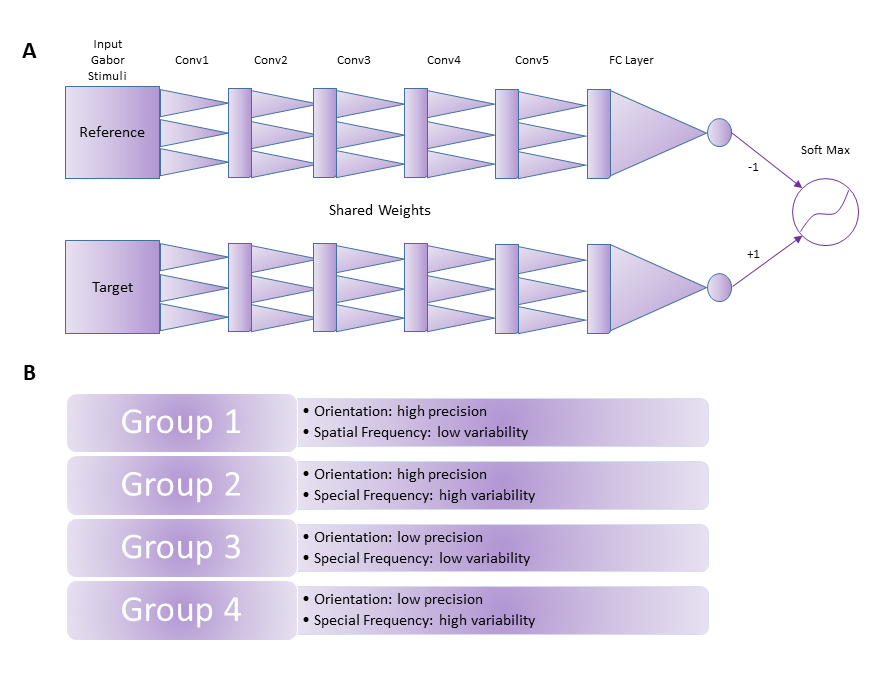

# DNNforVPL

Here we bring all the codes and experiments used to produce the figures of the following conference paper presented in the Champalimaud Research Symposium 2021:

Dizaji, A. S., Manenti, G. L., Schwiedrzik, C. M. (2021). Training a deep neural network on Gabor stimuli having a variable task-irrelevant feature increases generalization performance of the network.

We bring also some results not brought in the paper.

In summary, DNNforVPL is a deep neural network model used to simulate visual perceptual learning on a specific task and data structure. The aim of the task is to test hypotheses regarding generalization/transfer in visual perceptual learning.

## Instructions
Download and save the whole repository in your local drive. Unzip the four stimuli folders inside the data folder and put them in an appropriate location. To run the notebooks, you might need to change a few lines in the main codes to refer to the paths of the stimuli and results folders.

The following packages are required to be installed before running the source codes and demos of this repository:
- cvxpy
- matplotlib
- numpy
- pandas
- pingouin
- PIL 
- seaborn
- scipy 
- sklearn
- torch

## Schematic Plot of DNN and Data:

  

## Notes
1. The 'intrinsic_dimension_2NN.py' was adapted from: https://github.com/ansuini/IntrinsicDimDeep.
2. The 'mutual_info_EDGE.py' was adapted from: https://github.com/mrtnoshad/EDGE.
